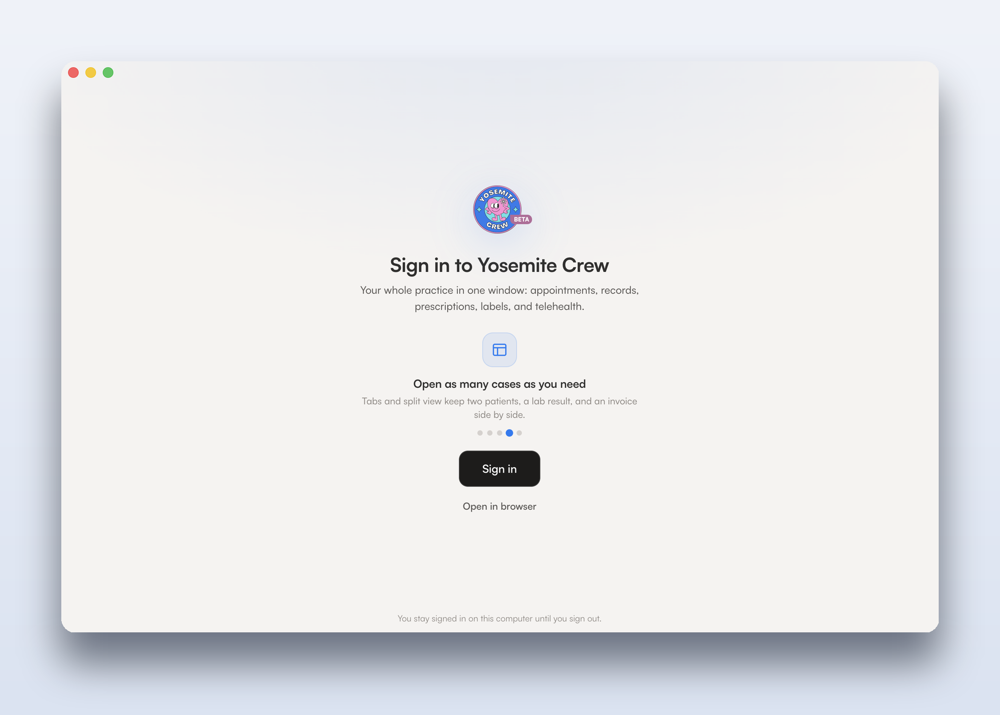
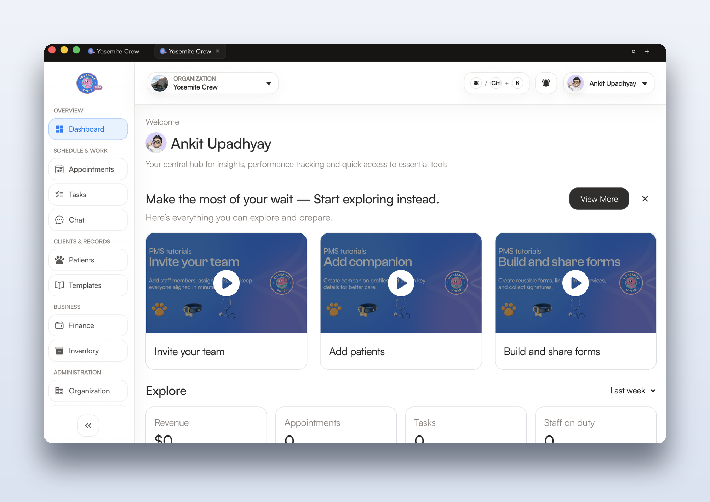
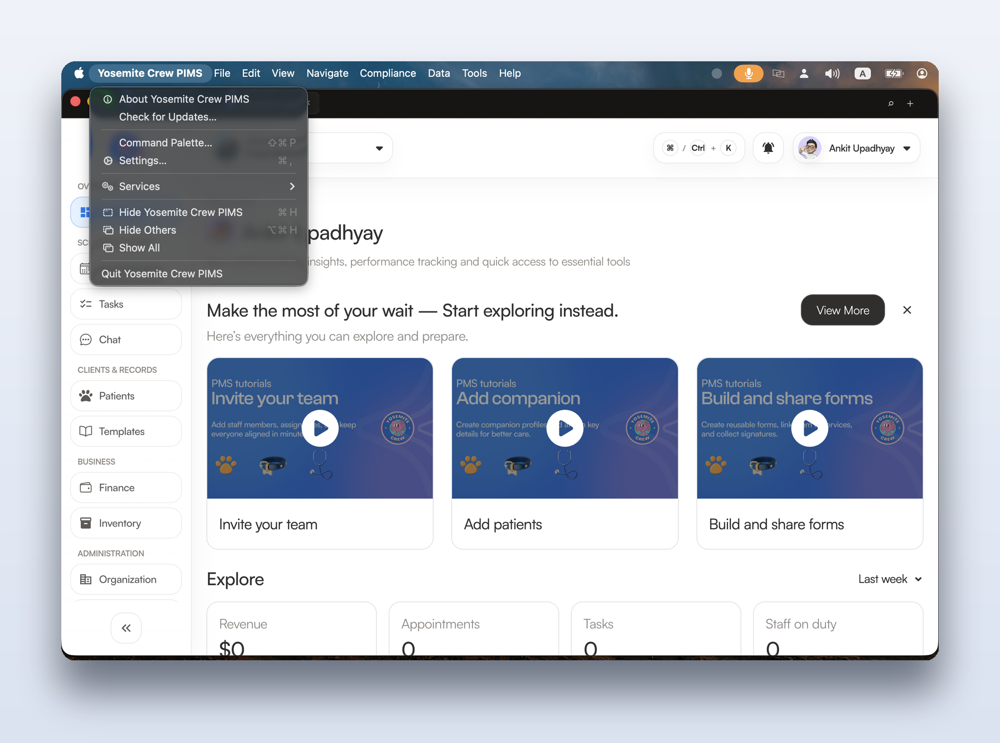
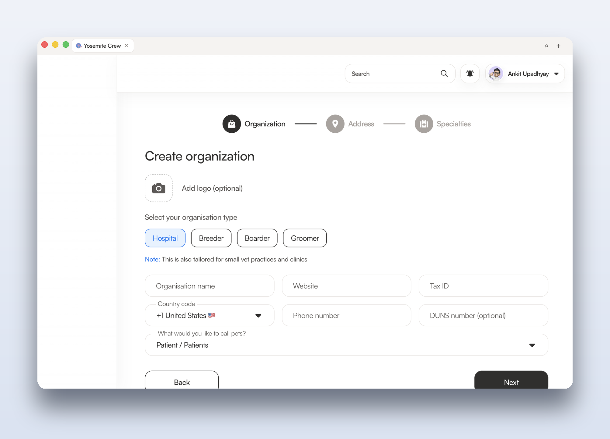

<p align="center">
  <a href="https://yosemitecrew.com/">
    
  </a>
</p>

<h1 align="center">Yosemite Crew PIMS — Desktop</h1>

<p align="center">
  The native desktop app for the open-source veterinary Practice Information Management System.<br />
  Fast, offline-aware, and built for the front desk and the exam room.
</p>

<div align="center">

[](https://yosemitecrew.com/)
[](https://github.com/YosemiteCrew/Yosemite-Crew/releases)
[](#-download)
[](https://www.electronjs.org/)
[](https://github.com/YosemiteCrew/Yosemite-Crew/blob/main/CONTRIBUTING.md)
[](https://discord.gg/SwM6mX85KD)

</div>

<div align="center">

[](https://sonarcloud.io/summary/new_code?id=yosemitecrew_Yosemite-Crew_Desktop)
[](https://sonarcloud.io/summary/new_code?id=yosemitecrew_Yosemite-Crew_Desktop)
[](https://sonarcloud.io/summary/new_code?id=yosemitecrew_Yosemite-Crew_Desktop)
[](https://sonarcloud.io/summary/new_code?id=yosemitecrew_Yosemite-Crew_Desktop)

</div>

> [!NOTE]
> Part of the [Yosemite Crew](https://github.com/YosemiteCrew/Yosemite-Crew) monorepo — the open-source operating system for animal health. This package is the **desktop client** for clinic staff. Looking for the web platform, mobile app, or backend? See the [root README](https://github.com/YosemiteCrew/Yosemite-Crew#readme).

---

## 📝 Overview

**Yosemite Crew PIMS Desktop** wraps the production Yosemite Crew practice-management experience in a fast, secure, native shell for **macOS, Windows, and Linux** — so a busy clinic gets a real desktop app instead of a browser tab that gets lost behind twenty others.

It's the same PIMS your team knows, plus the things only a native app can do: it **keeps working when the Wi-Fi doesn't**, opens charts and appointments in **real tabs**, fires **native notifications** for lab results and messages, prints labels and records, and stays **signed in across launches**. Records sync back automatically when you're back online.

<p align="center">
  
</p>

## ✨ Features

<table>
  <tr>
    <td width="50%" valign="top">
      <br />
      <sub><b>Dashboard &amp; navigation</b> — sidebar, <code>⌘K</code> command palette, and at-a-glance practice metrics.</sub>
    </td>
    <td width="50%" valign="top">
      <br />
      <sub><b>Native macOS menus</b> — a real menu bar with Command Palette, Settings, and built-in auto-update.</sub>
    </td>
  </tr>
  <tr>
    <td colspan="2" align="center" valign="top">
      <br />
      <sub><b>The full PIMS in native tabs</b> — every workflow opens in its own tab; split two side by side.</sub>
    </td>
  </tr>
</table>

**🖥️ A real desktop experience**
- Multi-tab browsing (Arc/Figma-style) — each tab is its own view; open, close, reorder, split two side-by-side, and restore your tabs on relaunch.
- Command palette (`Cmd/Ctrl+K`) for jump-to-anywhere navigation and quick actions.
- Native menus, right-click (undo/redo, copy-link, spellcheck), print (`Cmd/Ctrl+P`), and per-window zoom — all persisted.
- Window size, position, and theme (Light / Dark / System) remembered between launches.

**📶 Offline-first**
- A styled offline page with Retry / Open-in-browser instead of a dead tab — your session is preserved.
- Local encrypted page cache plus a write-behind sync queue; a visible **Sync status** and manual **Sync now** in Preferences.

**🔐 Security & compliance, built in**
- Encrypted **document vault** for files (lab results, consent forms, invoices).
- Compliance tooling: tamper-evident **audit log**, **controlled-substance** logbook with dual-witness, **DEA** registration + biennial reporting, and **PMP** submission queue.
- **Biometric / idle auto-lock** (Touch ID / Windows Hello), deny-by-default IPC, hardened Electron runtime, and signed + notarized release builds.

**🔗 Connected**
- Deep links: `yosemitecrew://appointments/123` focuses the app and opens the right record.
- **GetStream telehealth** launch path for in-app video visits.
- **Auto-updates** from GitHub Releases — new versions download in the background and install on restart.

## ⬇️ Download

Grab the latest signed build from the [**Releases page**](https://github.com/YosemiteCrew/Yosemite-Crew/releases):

| Platform | File |
| --- | --- |
| **macOS** (Apple Silicon / Intel) | `Yosemite Crew PIMS-<version>-mac-<arch>.dmg` |
| **Windows** | `Yosemite Crew PIMS-<version>-win-x64-setup.exe` (or the portable `.exe`) |
| **Linux** | `Yosemite Crew PIMS-<version>-linux-<arch>.AppImage` |

- **macOS** — open the `.dmg`, drag the app to Applications. Builds are **signed with a Developer ID and notarized**, so Gatekeeper opens them without warnings.
- **Windows** — run the installer. Builds are **Authenticode-signed** (publisher: *DuneXploration UG*). New certificates accrue SmartScreen reputation over time; if you see a "not commonly downloaded" prompt on day one, choose **More info → Run anyway**.

The app updates itself after install — no need to re-download for new versions.

## 🚀 Build from source

> Prerequisites: **Node.js**, **pnpm**, and Git. Run everything from the monorepo root.

```sh
pnpm install                 # install workspace dependencies
pnpm desktop:dev             # run the app against source (hot dev loop)
pnpm desktop:build           # type-check + compile src/ → build/
pnpm desktop:test            # unit tests (Jest)
pnpm desktop:pack            # build an unpacked local app in apps/desktop/dist
```

Create distributable installers for a platform:

```sh
pnpm desktop:dist:mac        # .dmg + .zip
pnpm desktop:dist:win        # NSIS installer + portable .exe
pnpm desktop:dist:linux      # AppImage
```

`desktop:pack` produces a runnable app for local testing; the `desktop:dist:*` commands produce the artifacts (and the `latest*.yml` auto-update feeds) you'd ship.

## 🛡️ Security & hardening

- **TypeScript is the source of truth** — `src/*.ts` compiles to `build/*.js`; Electron runs `build/main.js`.
- **Deny-by-default IPC** — only known channels are registered, payloads are validated, and calls must originate from bundled local pages or allowed PIMS origins.
- **Electron fuses** (applied in `afterPack`): `ELECTRON_RUN_AS_NODE` / inspect flags disabled, cookie encryption and asar integrity enabled.
- **Strict navigation policy** — only PIMS origins load in-app; developer-portal and external links open in the system browser.
- **Redacted structured logs** to the OS log directory; local crash dumps by default (no upload unless an intake URL is configured).

See [`docs/desktop-architecture.md`](docs/desktop-architecture.md) for the full process/IPC/trust-boundary model and [`docs/update-feed-threat-model.md`](docs/update-feed-threat-model.md) for update-channel risks.

## ⚙️ Configuration

Runtime is locked to production by default. These env overrides are for **staging/QA builds only**:

```sh
YC_DESKTOP_START_URL=https://staging.yosemitecrew.com/signin
YC_DESKTOP_ALLOWED_ORIGINS=https://staging.yosemitecrew.com   # comma-separated
YC_DESKTOP_PARTITION=persist:yosemitecrew-pims-staging
YC_DESKTOP_UPDATE_CHANNEL=beta            # default: latest
YC_DESKTOP_DISABLE_UPDATES=1
YC_DESKTOP_IDLE_LOCK_MINUTES=15
YC_DESKTOP_SYNC_URL=                      # authenticated PIMS sync endpoint
YC_DESKTOP_TELEMETRY=1
```

Most of these are also settable by an MDM-managed config for fleet deployments (see `src/utils/mdm.ts`).

## 📦 Releasing & signing

Release builds are produced with [`electron-builder`](https://www.electron.build/) and published to GitHub Releases (which also serves the [`electron-updater`](https://www.electron.build/auto-update) feed). Builds are code-signed per platform — macOS **Developer ID + notarization**, Windows **Authenticode** — with credentials supplied as CI secrets and **never** committed.

The full procurement + CI runbook (Apple Developer ID, notarytool, and the Windows signing options) lives in the release-signing docs. Signing credentials are optional locally: unset them and the build still succeeds **unsigned** for development.

```sh
# tag-driven release (once signing secrets are configured in CI)
# 1) bump "version" in apps/desktop/package.json
# 2) git tag desktop-v<version> && git push origin desktop-v<version>
```

## 🗂️ Project layout

```
apps/desktop/
├─ src/            # TypeScript: main process, IPC, tabs, sync, vault, compliance
├─ src/pages/      # local renderer pages (welcome, loading, offline, settings, …)
├─ resources/      # icons, entitlements, fonts
├─ scripts/        # build / fuses / notarize / static-copy helpers
├─ tests/          # Jest unit tests   ·   e2e/  Playwright tests
└─ docs/           # architecture, perf, threat-model, release notes
```

## 🤝 Contributing

Contributions are welcome! Please read the monorepo [Contributing guide](https://github.com/YosemiteCrew/Yosemite-Crew/blob/main/CONTRIBUTING.md). For desktop work, keep the quality gate green (type-check, lint, tests + coverage, SonarCloud) and add tests for any new module.

## 💬 Community & support

- 🌐 Website — [yosemitecrew.com](https://yosemitecrew.com/)
- 💬 Discord — [join the community](https://discord.gg/SwM6mX85KD)
- 🐛 Issues — [open an issue](https://github.com/YosemiteCrew/Yosemite-Crew/issues)

## 📄 License

Released under the license in the [Yosemite Crew repository](https://github.com/YosemiteCrew/Yosemite-Crew?tab=readme-ov-file). © DuneXploration UG (haftungsbeschränkt), Mainz.
